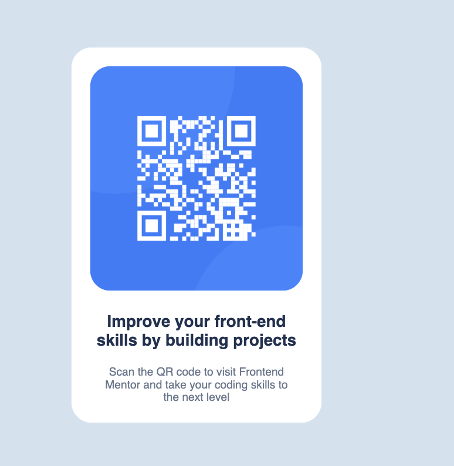

# Frontend Mentor - QR code component solution

This is a solution to the [QR code component challenge on Frontend Mentor](https://www.frontendmentor.io/challenges/qr-code-component-iux_sIO_H).

## Table of contents

- [Overview](#overview)
  - [Screenshot](#screenshot)
  - [Links](#links)
- [My process](#my-process)
  - [Built with](#built-with)
  - [What I learned](#what-i-learned)
  - [Continued development](#continued-development)
  - [Useful resources](#useful-resources)
- [Author](#author)
- [Acknowledgments](#acknowledgments)

**Note: Delete this note and update the table of contents based on what sections you keep.**

## Overview

### Screenshot

This is a cropped screenshot of the component styled 

### Built with

- CSS custom properties
- CSS Grid

### What I learned

This was a basic learning for grid and flexbox. 
The major challenge for me , was positioning the elements correctly as well figuring out the usage of figma files to get the properties of the components.

### Continued development

I wish to continue refining on dynamic positioning with respect to the window size , that hasn't been good for this project. Also , looking forward to learning more on positioning various elements on the screen via flexbox and grid and their varying usecases.
The main goal is to host a site using React+Tailwind CSS . I also wish to learn a bit more about hosting websites.

### Useful resources

- MDN webdocs 

## Author

- Website - Unique-GIT 
